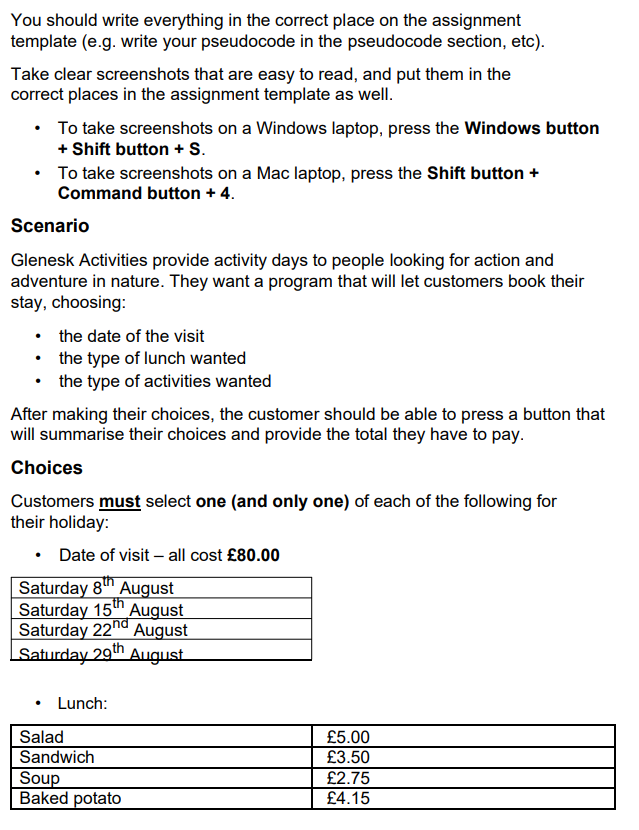
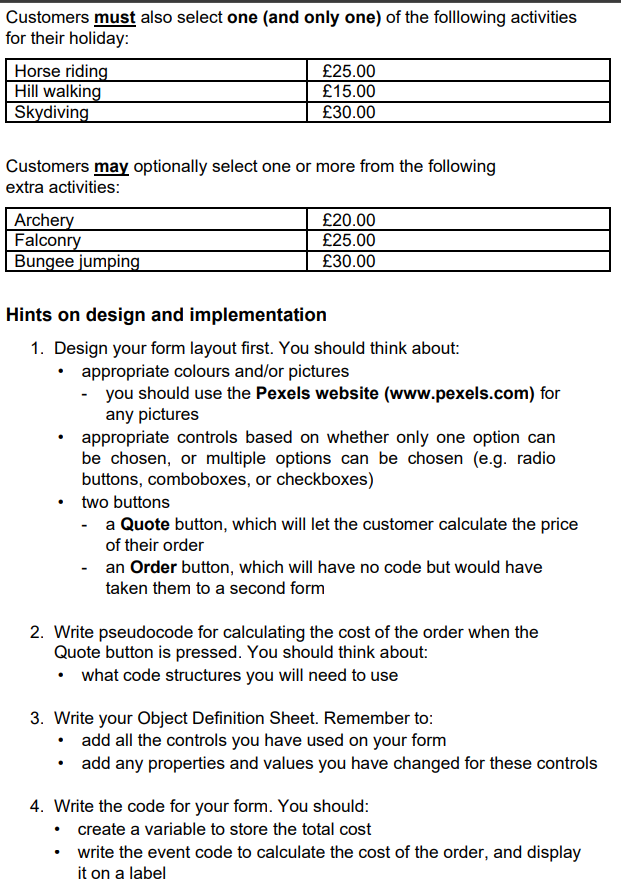
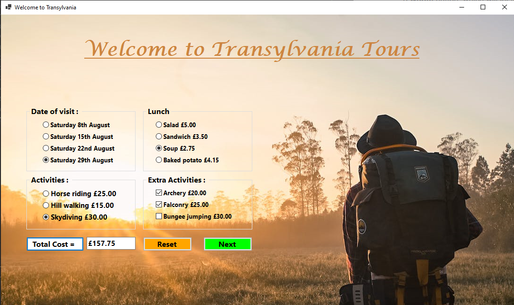
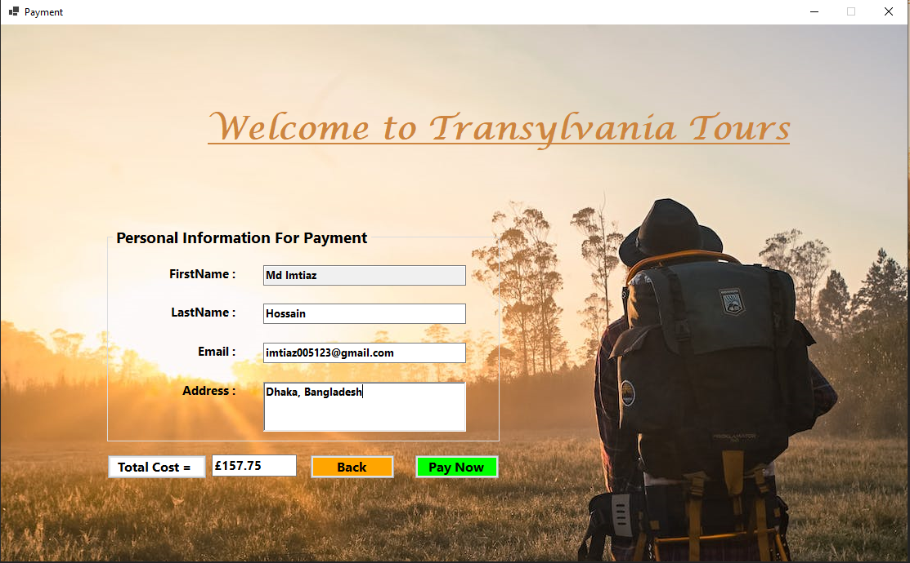
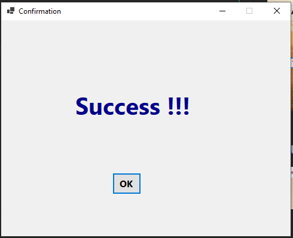

# Transylvania Tours (.NET 6.0)

This project involves creating a booking system for Glenesk Activities, allowing customers to choose the date, lunch
type, and activities. The form design includes suitable colors, controls (e.g., radio buttons), and buttons for quoting
and ordering. Pseudocode is developed for calculating the total cost when the "Quote" button is pressed, focusing on
effective code structures. The Object Definition Sheet documents all controls and their modified properties. The form's
code implementation includes a variable to store the total cost and event code to calculate and display the order cost.
User inputs include selecting a date (four options), lunch type (four options), and an activity (one of three options),
with optional extra activities. The system calculates the total cost upon clicking "Quote" and displays it to the user.
Overall, the project emphasizes a user-friendly interface and efficient cost calculation for a seamless booking
experience.

## Problem page- 01

## Problem page- 02

# ------------------------------

## Solution page- 01

## Solution page- 02

## Solution page- 03

